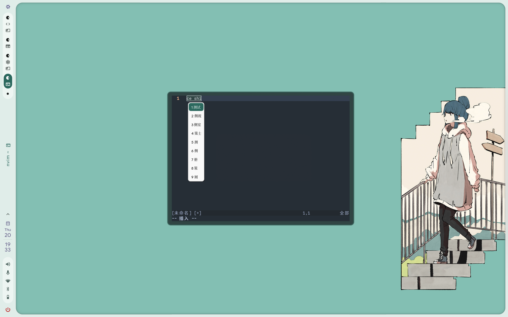
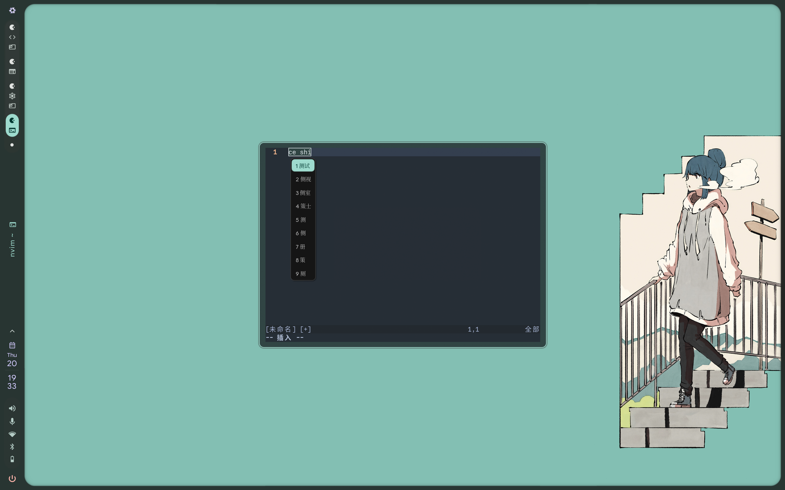
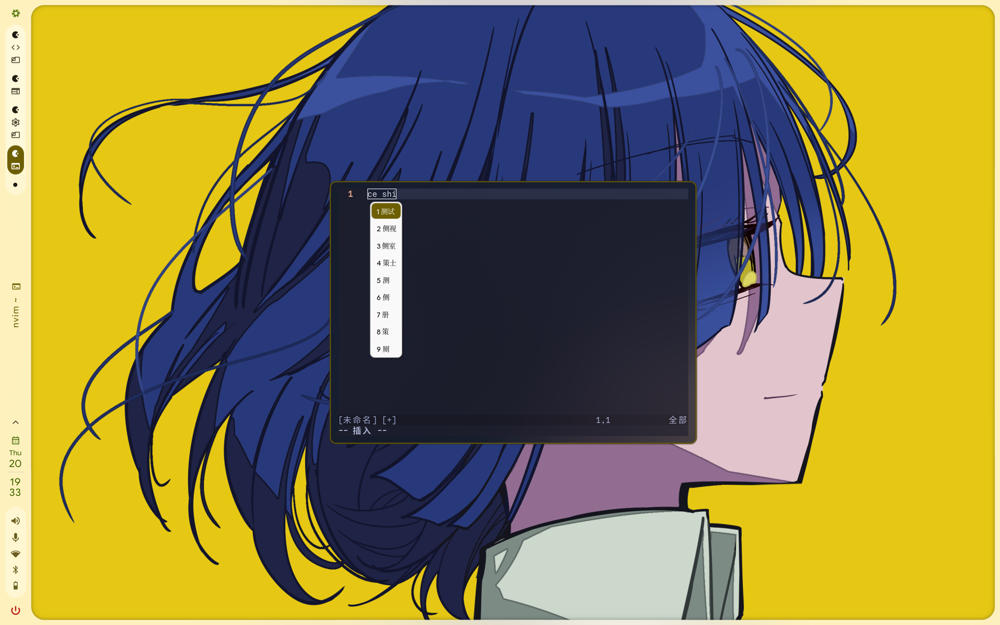
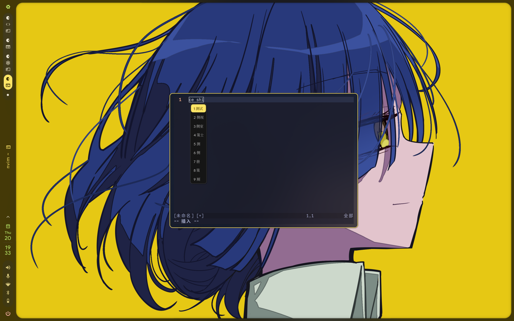

# fcitx5-mellow-themes-matugen

**English** | [简体中文](README.md)

[](LICENSE)
[](flake.nix)

Matugen-powered accent themes for Fcitx5 ClassicUI. The project keeps the rounded Mellow WeChat candidate window from [fcitx5-mellow-themes](https://github.com/sanweiya/fcitx5-mellow-themes), while deriving its highlight background and text colors from a Material You wallpaper palette.

Both light and dark variants are complete themes and work with ordinary ClassicUI candidate windows as well as GTK-embedded candidate windows rendered by fcitx5-gtk.

## Preview

Four wallpapers are shown in both light and dark modes, for eight Matugen palettes:

| Wallpaper | Light | Dark |
|---|---|---|
| Wallpaper 1 |  |  |
| Wallpaper 2 |  |  |
| Wallpaper 3 |  |  |
| Wallpaper 4 |  |  |

## Features

- Complete `mellow-matugen` and `mellow-matugen-dark` themes.
- Matugen `primary` for the rounded highlight and `on_primary` for highlighted text.
- Original Mellow WeChat panel geometry, shadows and spacing.
- Nix flake and distribution-independent manual installation.
- No dependency on Darkman, Waypaper or a particular desktop shell.

## How it works

Image-backed Fcitx5 highlights are not replaced by ordinary color fields, so this project renders both:

- `highlight.svg` from Matugen `primary`.
- A complete `theme.conf` with the original layout and `on_primary` text colors.

The complete file matters because fcitx5-gtk loads the first `theme.conf` found in the XDG search path and does not merge a user color fragment with a system theme.

## Installation

### Nix flake

```bash
nix profile install github:Shangshui0302/fcitx5-mellow-themes-matugen
```

As a Home Manager flake input:

```nix
inputs.fcitx5-matugen-theme = {
  url = "github:Shangshui0302/fcitx5-mellow-themes-matugen";
  inputs.nixpkgs.follows = "nixpkgs";
};

home.packages = [
  inputs.fcitx5-matugen-theme.packages.${pkgs.stdenv.hostPlatform.system}.default
];
```

The package installs themes under `share/fcitx5/themes/` and templates under:

```text
~/.nix-profile/share/matugen/fcitx5-matugen-theme/
```

### Generic Linux

```bash
git clone https://github.com/Shangshui0302/fcitx5-mellow-themes-matugen
cd fcitx5-mellow-themes-matugen

install -d ~/.local/share/fcitx5/themes ~/.config/matugen/templates/fcitx5-matugen-theme
cp -r themes/mellow-matugen themes/mellow-matugen-dark ~/.local/share/fcitx5/themes/
cp -r templates/. ~/.config/matugen/templates/fcitx5-matugen-theme/
```

## Prompt for a General-Purpose Agent

If the user is unfamiliar with Fcitx5, Matugen or the current desktop environment, give the following prompt to a general-purpose agent. The agent should inspect existing configuration before changing it.

```text
Please install and configure this repository in the current Linux user environment:
https://github.com/Shangshui0302/fcitx5-mellow-themes-matugen

Goal: make both Fcitx5 ClassicUI and fcitx5-gtk GTK-embedded candidate windows use the rounded Mellow WeChat style, while deriving highlight background/text colors from Matugen primary/on_primary colors. Keep the candidate list vertical.

Work in this order:
1. Inspect the distribution, whether it is NixOS, installed Fcitx5/Fcitx5-gtk and Matugen, the current ClassicUI config, existing light/dark mode manager, and XDG data paths.
2. Prefer a Nix flake/package on NixOS. On other Linux systems install the repository's themes and templates for the user. Do not use npm, pip or curl|sh.
3. Install both complete themes: mellow-matugen and mellow-matugen-dark. Do not create sparse theme.conf files containing only colors; GTK-embedded candidates need complete Metadata, Background, Highlight, image references and margins.
4. Add the four Matugen templates to the existing Matugen configuration: light/dark theme.conf and highlight.svg outputs must go to their matching user theme directories. Do not assume Darkman, Noctalia or Waypaper; reuse the user's existing mode and wallpaper manager.
5. Preserve unrelated settings in ~/.config/fcitx5/conf/classicui.conf, but ensure these keys are correct:
   Theme=mellow-matugen or mellow-matugen-dark (according to the current mode)
   DarkTheme=mellow-matugen-dark
   UseDarkTheme=True
   Vertical Candidate List=True
6. Back up existing configuration before editing and do not delete other themes. On NixOS, only edit Nix files in the configuration repository, show the diff, and let the user run rebuild/switch themselves.
7. Run Matugen once after configuration, restart or reload Fcitx5, and verify ordinary ClassicUI and GTK-embedded candidates keep the rounded layout, image highlight, generated accent color and vertical arrangement.
8. Report the installation method, files written, mode-switch command, wallpaper-switch command, verification result, and any command the user must run manually.
```

## Matugen configuration

Add the four templates below to your Matugen configuration. Replace every path with an absolute path for your account:

```toml
[templates.fcitx5-light-theme]
input_path = "/home/USER/.config/matugen/templates/fcitx5-matugen-theme/mellow-matugen/theme.conf.tpl"
output_path = "/home/USER/.local/share/fcitx5/themes/mellow-matugen/theme.conf"

[templates.fcitx5-light-highlight]
input_path = "/home/USER/.config/matugen/templates/fcitx5-matugen-theme/mellow-matugen/highlight.svg.tpl"
output_path = "/home/USER/.local/share/fcitx5/themes/mellow-matugen/highlight.svg"

[templates.fcitx5-dark-theme]
input_path = "/home/USER/.config/matugen/templates/fcitx5-matugen-theme/mellow-matugen-dark/theme.conf.tpl"
output_path = "/home/USER/.local/share/fcitx5/themes/mellow-matugen-dark/theme.conf"

[templates.fcitx5-dark-highlight]
input_path = "/home/USER/.config/matugen/templates/fcitx5-matugen-theme/mellow-matugen-dark/highlight.svg.tpl"
output_path = "/home/USER/.local/share/fcitx5/themes/mellow-matugen-dark/highlight.svg"
```

Nix users can point `input_path` to the matching profile paths. Run Matugen normally afterwards:

```bash
matugen image /path/to/wallpaper.png -m dark -t scheme-content --prefer saturation
```

## Fcitx5 configuration

`~/.config/fcitx5/conf/classicui.conf` has no section header:

```ini
Theme=mellow-matugen-dark
DarkTheme=mellow-matugen-dark
UseDarkTheme=True
Vertical Candidate List=True
```

Set `Theme=mellow-matugen` in light mode and `Theme=mellow-matugen-dark` in dark mode. GTK Wayland clients read `Theme` directly, so changing only `DarkTheme` and `UseDarkTheme` is insufficient.

Restart Fcitx5 after a palette, wallpaper or mode change:

```bash
systemctl --user restart app-org.fcitx.Fcitx5@autostart.service \
  || fcitx5-remote --check -r
```

A Darkman hook typically renders Matugen, updates the current `Theme`, and restarts Fcitx5. This repository deliberately does not own the global light/dark state.

## Compatibility and limitations

- Requires Fcitx5 ClassicUI and Matugen.
- Your existing tooling remains responsible for mode state, wallpaper selection and reloads.
- GNOME Kimpanel, KDE Input Method Panel and similar external panels draw their own candidate window and do not use ClassicUI themes.
- Flatpak GTK applications must be able to read the user theme directory or host profile; sandbox permissions are outside this project.

## License and upstream

Licensed under the [BSD 2-Clause License](LICENSE). The original Mellow layout and SVG assets are copyrighted by sanweiya; see [NOTICE](NOTICE) for provenance and the source revision.

Upstream: [sanweiya/fcitx5-mellow-themes](https://github.com/sanweiya/fcitx5-mellow-themes)
